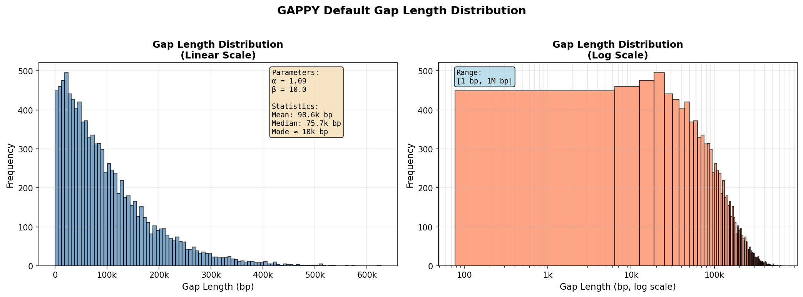

# gappy

A genome assembly gap simulator that splits contigs/scaffolds at random positions to simulate gaps with gap lengths sampled from a beta distribution. It can also simulate sequencing errors.

> [!NOTE]
> This is a pretty naive implementation for the task largely written using AI. A more realistic simulation of worsening assembly quality can be achieved by downsampling sequencing reads and reperforming assembly. That however requires sequencing reads to be available, is more involved computationally, and is less straightforward to perform if working with MAGs.

## Overview

`gappy` is a Python tool designed to simulate gaps in genome assemblies for testing and benchmarking purposes. It takes a genome file in FASTA format and splits sequences at random positions to create fragmented assemblies, with gap lengths controlled by a beta distribution.

Instead of inserting gap characters (N's), gappy splits your sequences into multiple smaller contigs, simulating real assembly fragmentation.

## Features

- Ability to sample gap lengths from customizable beta distribution
- Optional mutation rate argument to allow simulation of sequencing errors
- Automatic contig renaming (e.g., chr1 → chr1_0, chr1_1, chr1_2, etc.)
- Creation of a position mapping file to show how original positions map to gapped genome

## Installation

### Quick install (requirements only)

```bash
# in an environment with Python3, Biopython and Numpy
# within the git directory
pip install . 
```

## Usage

### Basic usage

```bash
gappy input_genome.fasta -o fragmented_output.fasta -p 80
```

This will remove ~20% of the genome by splitting sequences, leaving 80% intact. Uses smart defaults (peak at ~10kb, gaps up to 1Mbp).

**Output files:**
- `fragmented_output.fasta` - The gapped genome assembly
- `fragmented_output.fasta.mapping` - Position mapping file (see below)

When outputting to stdout (no `-o` flag), the FASTA goes to stdout and the mapping is printed to stderr.

### Command-line options

```
positional arguments:
  input_fasta           Input genome file in FASTA format

required arguments:
  -p, --percent-remaining  Percentage of genome to remain (0-100)

optional arguments:
  -h, --help            Show help message and exit
  -o, --output          Output FASTA file with split sequences (default: stdout)
  -a, --alpha           Alpha parameter for beta distribution (default: 1.09)
  -b, --beta            Beta parameter for beta distribution (default: 10.0)
  --min-gap-size        Minimum gap size in base pairs (default: 1)
  --max-gap-size        Maximum gap size in base pairs (default: 1000000)
  --mutation-rate       Point mutation rate, 0.0-1.0 (default: 0.0)
  --ts-tv-ratio         Transition/transversion ratio (default: 2.0)
  --seed                Random seed for reproducibility
```

### Beta Distribution Parameters

The beta distribution controls the distribution of gap lengths:

- **Alpha (α) and Beta (β)**: Shape parameters of the beta distribution
  - α > β: Distribution skewed towards larger gaps
  - α < β: Distribution skewed towards smaller gaps
  - α = β: Symmetric distribution
  - Both = 1: Uniform distribution
  - Both > 1: Bell-shaped distribution

The sampled values from Beta(α, β) are scaled to the range [min-gap-size, max-gap-size].

The default parameters (α=1.09, β=10.0, range=[1, 1M bp]) create a heavily right-skewed distribution with a mode around 10kb and a long tail up to 1 Mbp, mimicking realistic gap size distributions in draft assemblies:



*Figure: Gap length distribution with default parameters. Left panel shows linear scale with peak near 10kb; right panel shows log scale revealing the full range up to 1M bp.*

## Requirements

- Python >= 3.7
- BioPython >= 1.79
- NumPy >= 1.21.0

## Contributing

Contributions are welcome! Please feel free to submit a Pull Request.
